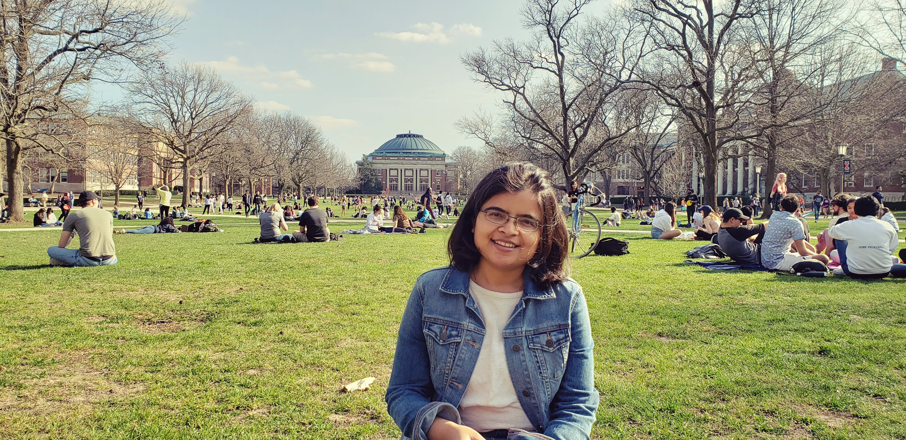
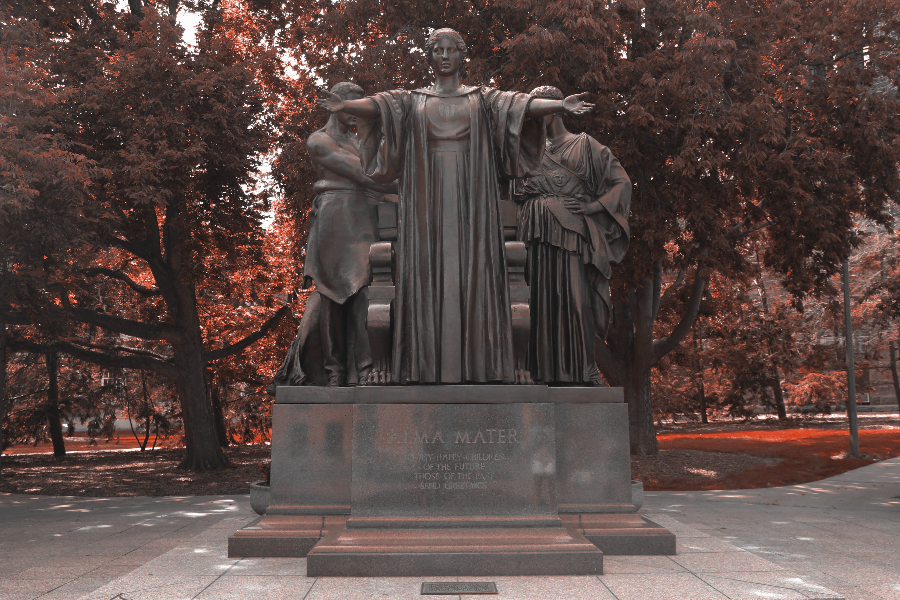
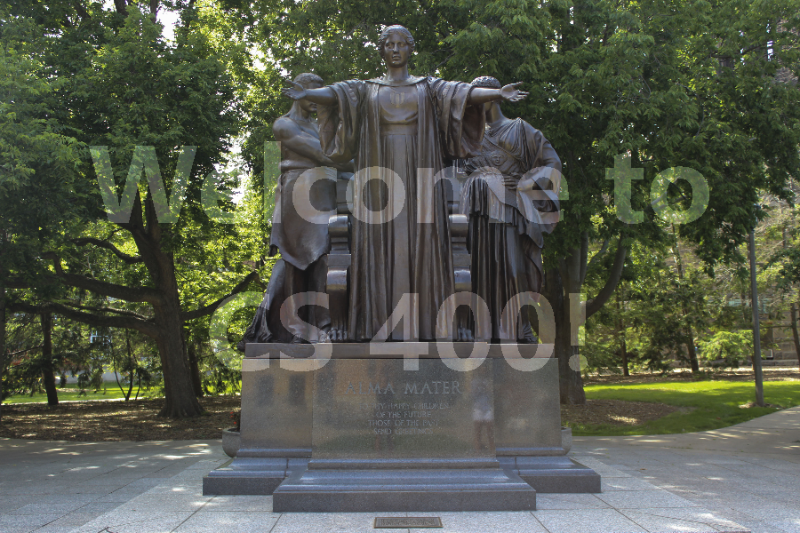

Thanks for visiting my site ! A little bit about myself, I am currently a graduate student, pursuing doctoral degree in Nuclear Physics at University of Illinois at Urbana-Champaign. I am working on my thesis titled "Absolute cross section measurement from p+d & p+p Drell Yan measurement at SeaQuest". SeaQuest is a fixed target experiment located at FermiLab aimed at studying the substructure (specifically sea-quarks) inside nucleons. I joined the experiment in September 2013 and have been fortunate to learn a wide variety of skills while working on it. I have been actively involved in analysing large-scale dataset using MySQL, CERN-Root (scientific toolkit for processing large-scale data and statistical analysis) and Python. One of the most significant aspect of data analysis that I have learned and enjoyed in my research is to stare at the data and ask critical questions about the various features it possesses and eventually figure out explanations for such features.   

[LinkedIn](https://www.linkedin.com/in/shivangiphy/) | [GitHub](https://github.com/shivangiphy) 

# Projects
* Image Transform project (CS400):
This project was a part of the final week assignment of an online course on Coursera on [Object-Oriented Data Structures in C++](https://www.coursera.org/learn/cs-fundamentals-1) taught by Prof. Ulmschneider from department of computer science at UIUC. It is such a well designed course for people from all background who are interested in understanding the essential componenets of a C++ code. The goal of this project was to transform the given image by changing the Hue, Saturation or Luminance of the pixel.
The first part of the assignment was to 'Illinify' the image, which is explained as follows. Hue itself refers to the color of the pixel. The color range is defined in between 0 and 360. The hue of each pixel should be set to either 'Illini orange' which has a hue of 11 or 'Illini Blue' which has a hue of 216, depending on which hue value the original hue of the pixel is closer to. 
| | |
The second part of the project was to put a spotlight on the image. What this means is to decrease the luminance (or brightness of the pixels) with increasing radial distance around a central pixel. In this case the luminance was decreased by 0.5% per pixel unit in euclidean distance with a maximum of 80% decrease.
 
The third part of the project required putting a watermark on the image. This requires the use of an overlay image as a stencil, to find out the pixels in the Alma image that intersects with overlay image where the luminance is 1. The luminance of such pixels in original image were increased by 0.2 (witha maximum allowed value upto 1)
|

* [Masters thesis](./assets/projectreport_MScThesis.pdf)
* [Internship at Raman Research Institute](./assets/sz_rri.pdf)

In addition to learning more about the fundamental nature of everything in the universe, I spend time cooking, gardening and solving/creating puzzles.

# Escape room lover

# Cook

# Gardener
